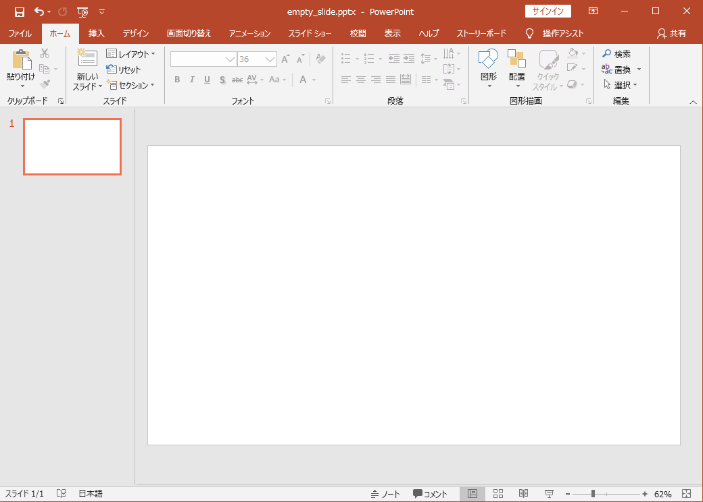
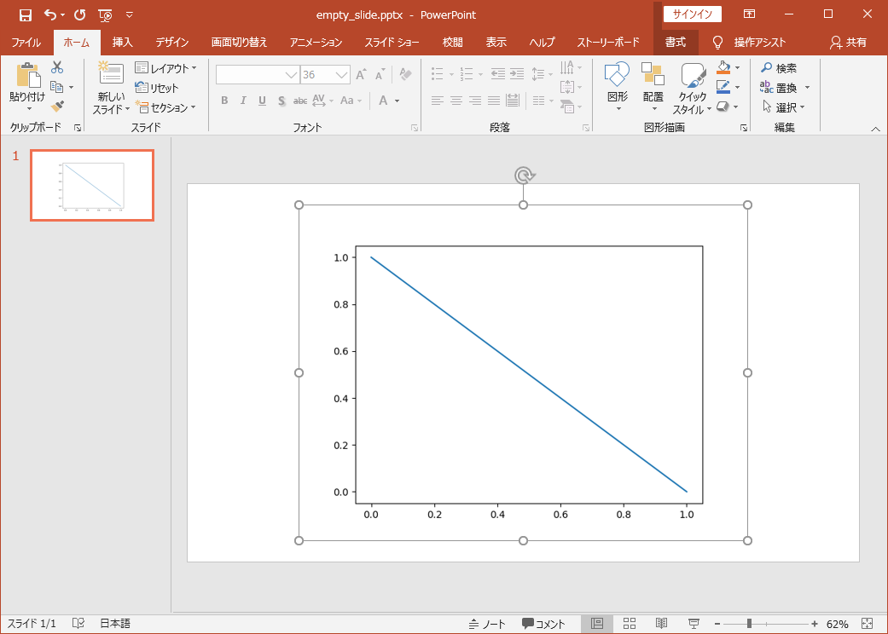
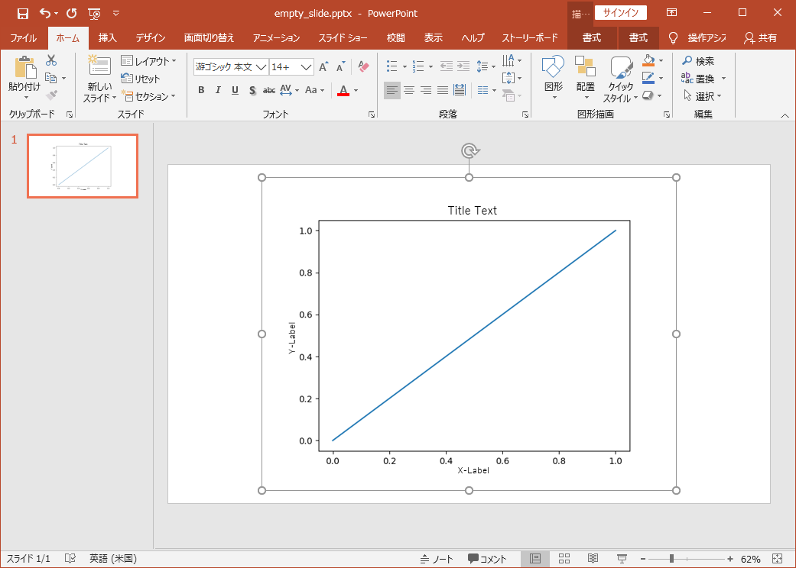
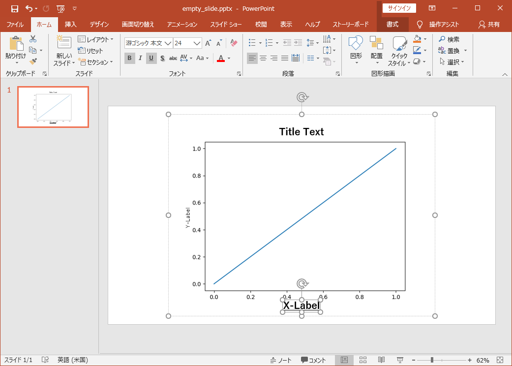

# Getting Started

## Introduction
I'd like to introduce basic usage of ``figpptx`` in this page.  
If you learn how to use ``rasterize`` and ``send`` function, then
it is all right for 80% of use cases.  
In this short tutorial, these two functions are explained.


### ``rasterize`` function
This section explains how to send Figure of matplotlib as an image.

#### Step 1. Prepare a slide.

Firstly, please prepare PowerPoint Slide as below.




#### Step 2. Plot a Figure and rasterize.
A rasterized figure is transferred to a slide with the below code. 
Please execute it. 

```
import matplotlib.pyplot as plt
import figpptx

fig, ax = plt.subplots()
ax.plot([0, 1], [1, 0], label="Line") 
figpptx.rasterize(fig)
```

The result.




!!! Tip
    With ``Alt``+``Tab`` key, the active window changes.
    This shortcut is useful to switch between PowerPoint
    and application for python codes such as Vim, VSCode, Pycharm, or Jupyter Notebook. 


### ``send`` function
``rasterize`` function is sufficient if what you want is an image.
However, sometimes, you would like to edit details of figure
when making presentation.
This section explains ``send`` function.

For example, use ``send`` if you want to modify texts of label of your figure.


#### Step 1. Prepare a slide.

Firstly, please prepare PowerPoint Slide as the previous section. 


#### Step 2. Plot a Figure and send.
Please execute the below code.

```python
import matplotlib.pyplot as plt
import figpptx

fig, ax = plt.subplots()
ax.plot([0, 1], [0, 1], label="Line") 
ax.set_xlabel("X-Label", fontsize=14)
ax.set_ylabel("Y-Label", fontsize=14)
ax.set_title("Title Text", fontsize=18)
figpptx.send(fig)
```

The result.



Since texts of titles and labels are PowerPoint Objects, you can edit them.




## Conclusion 
This tutorial describes.

* How to use ``rasterize`` function.
    - Transfer a Figure as an image.

* How to use ``send`` function.
    - Some texts are PowerPoint Objects.
    - possible to modify them.  

If you need customizations of procedures, or have interests in internal mechanism, 
please read the advanced tutorials and code themselves.
